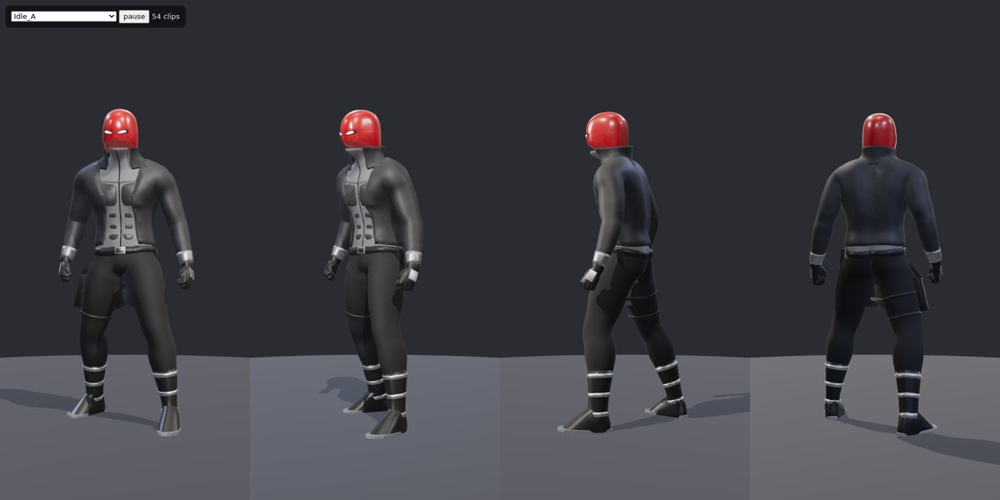
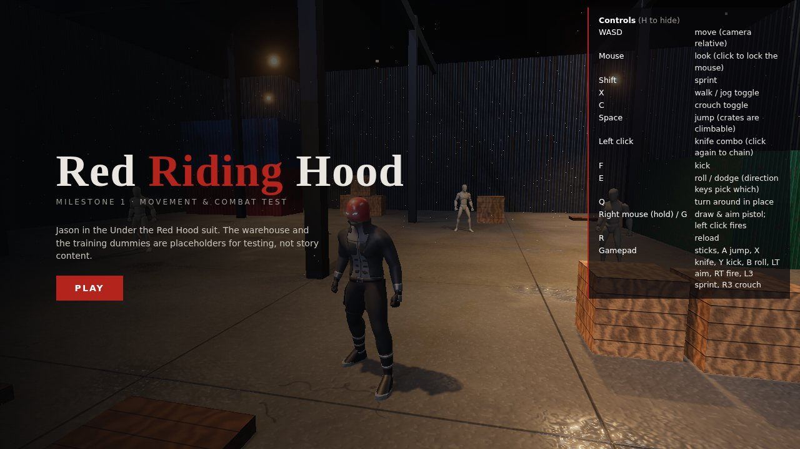
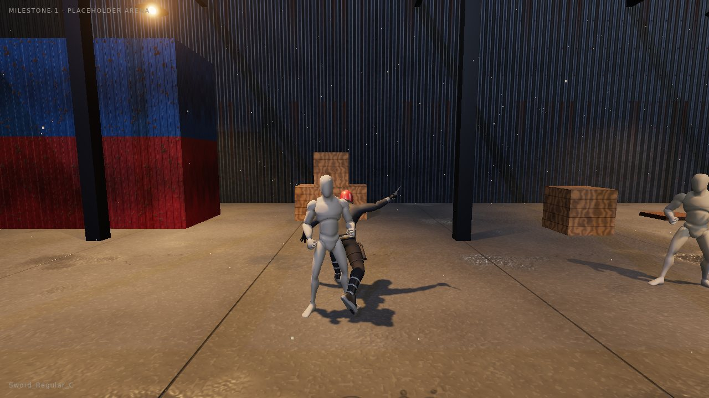
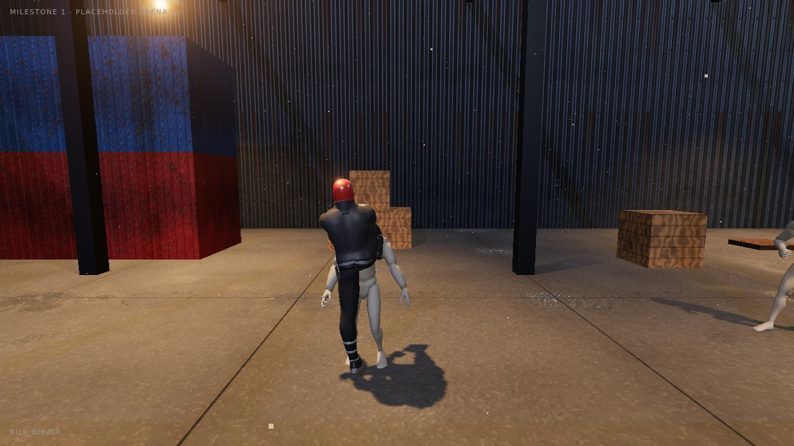
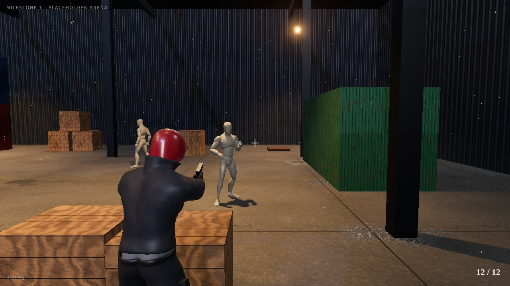
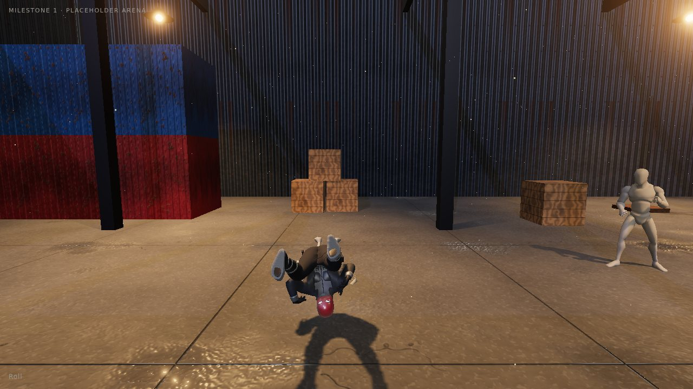
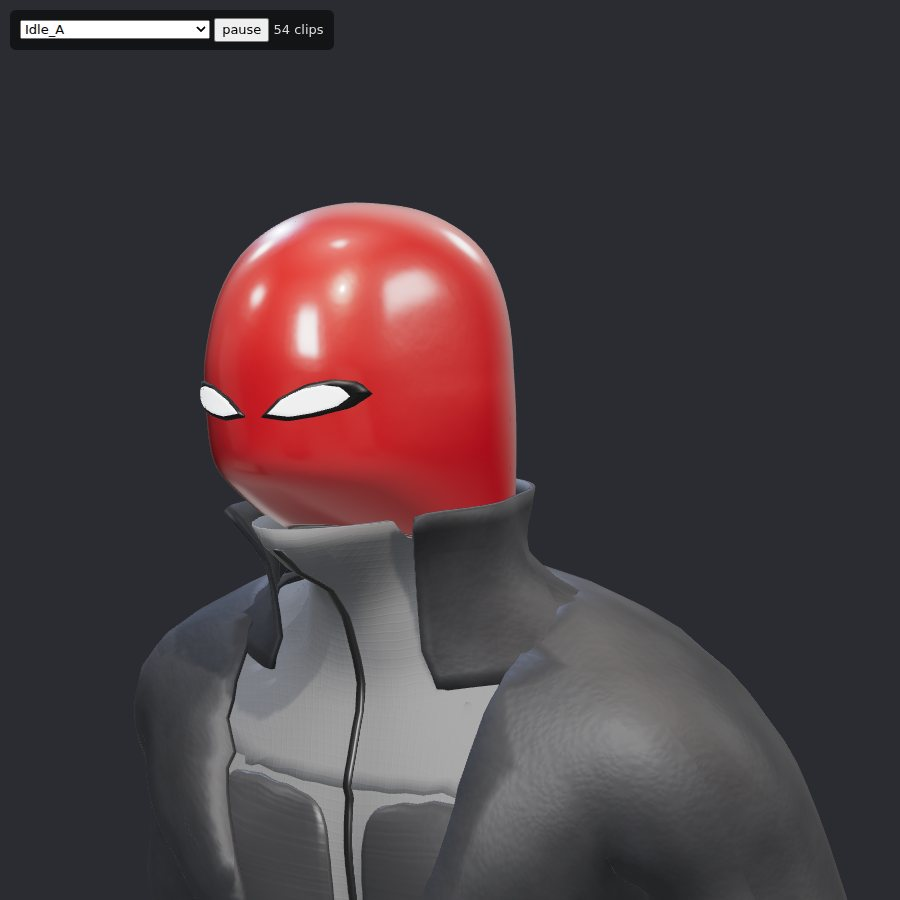

# Red Riding Hood — Milestone 1

Unofficial, non-commercial Jason Todd fan game. This folder is **milestone 1: a playable movement and combat test**. It is not the full game. It proves the pipeline the rest of the game will use: a realistic, rigged, animated Jason in the main Under the Red Hood suit, controlled in third person in a real-time 3D scene.



| | |
|---|---|
|  |  |
|  |  |
|  |  |

## Run it

**Easiest:** open `red-riding-hood.html`. It's one self-contained file (about 12.5 MB) with the code, three.js and both models built in, so it works offline by double-clicking, with no server. Rebuild it with `npm install && node tools/build_standalone.mjs` after changing the game.

**From the source files** (for development), ES modules need a web server (opening `index.html` from disk will not work):

```sh
cd red-riding-hood
node tools/serve.mjs        # then open http://localhost:8080
```

Any static server works (`python3 -m http.server 8080` too). Nothing is downloaded at runtime: three.js is vendored in `vendor/three/`. `?q=low` lowers the render quality for weak machines. `viewer.html` is a model and animation viewer for checking the character.

## Combat (Metal Gear Rising style)

Speeds: Jason runs at 7.5 m/s and Ninja Runs at 13 m/s. Attacks play at 1.3–2.4× the library speed. Enemies sprint at 5–7 m/s.

| Input | Action |
|---|---|
| WASD · Mouse | move · look (click locks the mouse) |
| Left click | attack; keep clicking for combos. **Red glint on an enemy: attack = parry** (right before the hit = perfect parry with counter) |
| Right click | heavy attack. **Hold** = launcher (keep holding to jump after him). In the air = plunge slam |
| Shift | Ninja Run (vaults crates, deflects bullets; attack while running = dash stab / charge) |
| Space | jump; click in the air for the air combo |
| E | dodge. **Yellow glint** = can't be parried, dodge it |
| F (hold) | **Blade Mode**: move the mouse to aim the cut, click to cut (right click cuts across). **Blue glow** = cut it for **Zandatsu** |
| Q | shoot: tap = auto-aimed quick shot, hold = aim and click. Reloads by itself |
| C | crouch; crouched attacks are low slashes and a slide tackle |
| H | show / hide controls |
| Gamepad | X attack · Y heavy (hold = launch) · A jump · B dodge · RB Ninja Run · LB Blade Mode · RT shoot · LT aim · L3 crouch |

**Enemies** come in endless waves. They use free CC0 character models by elbolilloduro, from the [Mesh2Motion](https://github.com/scottpetrovic/mesh2motion-app) library and already rigged to the same skeleton as the animations:
- **Brawler** (street thugs `male_6/10/15/32`): jab, cross, hook, kick, shove; blocks some light hits.
- **Blade thug** (masked killers `killer_4/5/6`, with a machete): three slashes, a lunge, and an unparryable overhead.
- **Gunman** (`swat_male`, balaclava): keeps 7–11 m away and strafes; bullets can be parried, deflected by Ninja Run, or cut in Blade Mode.
- **Brute** (`monster`, a pale feral man): bigger, armoured (light hits don't stagger him), with a ground pound and a charge (both yellow) and a parryable haymaker. Break his poise with heavy hits and parries.

At most two of them attack at once. They block (heavy attacks break guard), dodge, brace while you combo them, stagger, get knocked down and get up, fly when launched, and die by animation chosen from how they were hit (four death clips, knockback flips, falls from the air). Bodies stay with spreading blood pools. HUD: health, Blade Mode gauge, hit counter, Battle Points, wave.

**Not like Metal Gear Rising yet:** no bosses, no executions or Ripper Mode, no upgrade shop, one blade (the UTRH knife; the sword clips drive it), placeholder enemies. The **Zandatsu reward (health + gauge) is my provisional choice.** The brief says not to import Raiden's cyborg fuel explanation, so nothing in the game explains it yet.

## What is real and what is placeholder

**Real (meant to carry forward):**
- **Jason's model** (`assets/models/jason.glb`). A MakeHuman body built here from its CC0 data, wearing the main UTRH suit modelled from refs 1–3:
  - smooth red helmet with angled white lenses and dark surrounds
  - grey high-neck zipped under-layer with darker chest and ab plates
  - cropped dark leather jacket with a standing collar, open at the front
  - belt with a rectangular buckle
  - black trousers bloused into boots with grey straps and soles
  - gloves with grey cuffs and back plates
  - right-thigh holster with a pistol grip, and a knife sheath on the left hip
  - **no bat emblem anywhere**
- **Rig and 67 animations** on Jason's own skeleton (from the Mesh2Motion CC0 library): idle, walk, jog, sprint, crouch, stealth, strafes, turns, rolls, dodges, jumps, knife/sword combos, punches, kick, pistol aim/shoot/reload, hit reactions, deaths.
- **The combat controller** described above. Strike frames are detected automatically from each animation (the fastest-moving hand or foot), and leg speed is matched to the clips, so feet don't slide.
- **The Blade Mode slicer** (`js/slicer.js`): freezes the animated mesh, splits its triangles by the plane, caps the cut and simulates the pieces.
- **The build pipeline.** Everything is regenerated from scripts (see below), so the model can be changed and rebuilt in about 40 seconds.

**Placeholder (for testing only, not story content):**
- **The warehouse arena.** No story location is decided; Japan, Nanda Parbat, Hawaii and Texas are still open.
- **The enemy models.** They're free CC0 stand-ins, low-poly with photo textures, until there are designed characters. I left out `killer_7` (a clown mask) because of the brief's Joker exclusion.
- **The knife and pistol geometry.** It is simple: the knife follows the wavy UTRH blade from ref 2; the pistol is generic.
- **Sound.** All of it is synthesised in the browser. No music is included.

**My provisional choices (not from the brief, change freely):**
- Body: age set to read about 21 (the brief says "19?"), height 1.855 m, athletic. These are parameters in `tools/mh_body.py`.
- The key bindings and the decision to use Mesh2Motion's sword clips for the knife.
- The weapon handling in this test: knife on the mouse, gun on aim. **This does not decide the weapon-switching question in the brief.**

## Honest limits of this milestone

- It is **realistic-proportioned, not photoreal**. The suit is generated from the body surface, so it has no cloth simulation and no sculpted wrinkles. Detail comes from normal maps.
- **Only the masked look is done.** The unmasked face (ref 3), the alternate suits and the civilian outfits are not modelled yet. The bare body is still in `build/jason.blend` for that work.
- The animations are general-purpose library clips, not custom Jason mocap. Zandatsu, parry, progression, story, choices and saving are **not implemented**. They are the next milestones.
- The automated test renders in software (SwiftShader), so **real-GPU frame rate has not been measured**.

## Rebuild the model

```sh
pip install bpy==4.5.4 scipy pillow     # Blender as a Python module, no Blender install needed
sh tools/fetch_sources.sh               # CC0 source data -> .sources/ (git only)
python3 tools/build_jason.py            # -> assets/models/jason.glb (+ build/jason.blend)
python3 tools/build_dummy.py            # -> assets/models/dummy.glb
npm install && node tools/play_test.mjs # optional: scripted play-test screenshots -> build/play/
```

| File | What it does |
|---|---|
| `tools/mh_body.py` | MakeHuman hm08 base mesh + age/gender/muscle/height targets, joints, skin weights |
| `tools/rig_body.py` | bends the body into the Mesh2Motion T-pose (limbs only) |
| `tools/build_jason.py` | fits the Mesh2Motion skeleton to Jason, keeps every bone's orientation so the clips play unchanged, exports the GLB |
| `tools/suit.py` | the suit, every piece generated from the body surface (shells, bands, hull-built helmet and boots) |
| `tools/materials.py` | PBR materials with textures generated in numpy (leather, twill, knit, brushed metal, tread, paint) |
| `js/player.js` | Jason: moves, strings, parry, Blade Mode, Zandatsu, pistol |
| `js/enemies.js` | enemy types, AI, attack tokens, reactions, deaths, waves, bullets |
| `js/slicer.js` | Blade Mode mesh cutting and pieces |
| `js/fx.js` | blood, splats, pools, sparks, glints, shockwaves, blade trail |
| `js/arena.js`, `js/textures.js` | placeholder arena with procedural concrete, corrugated steel, wood and painted steel |

## Sources and licences

- **Body:** [MakeHuman / MPFB2](https://github.com/makehumancommunity/mpfb2) assets — CC0.
- **Enemy models:** elbolilloduro and Quaternius characters via Mesh2Motion — CC0 (licences listed in Mesh2Motion's `src/lib/RigModelVariations.ts`).
- **Skeleton and animations:** [Mesh2Motion](https://github.com/scottpetrovic/mesh2motion-app) — art assets CC0, code MIT.
- **Engine:** [three.js](https://threejs.org) r186 — MIT (`vendor/three/LICENSE`).
- **Textures, sounds, suit, arena:** generated by the scripts in this folder.
- Red Hood, Jason Todd and Under the Red Hood belong to DC. This is a non-commercial fan project.

## Why Jason is still the custom model

I searched for a free Red Hood model to use instead (October 2026). There is no free, full-body, rigged one:
- The rigged Red Hood models are paid: [CGTrader](https://www.cgtrader.com/3d-models/character/man/red-hood), [Sketchfab Store](https://sketchfab.com/3d-models/red-hood-character-rig-67bf19ea651140148ba2d4bffbe5ce3e), [RenderHub](https://www.renderhub.com/billnguyen1411/red-hood-character-rig).
- The free ones are helmets only. [RockitStorm's helmet](https://sketchfab.com/3d-models/red-hood-helmet-and-weapon-models-89a03c6a0c5942c08a488228b6a9dd5f) is CC-BY but marked NoAI, so I did not process it.
- "Free" sites like [assetsfree.com](https://assetsfree.com/red-hood-10/) host ripped game models, which can't be redistributed.

Sketchfab is also blocked from the build environment. If you buy or download a rigged Red Hood you have the rights to use, drop the file in and it can be swapped in.
